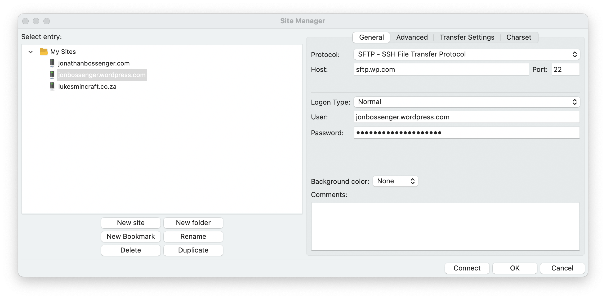
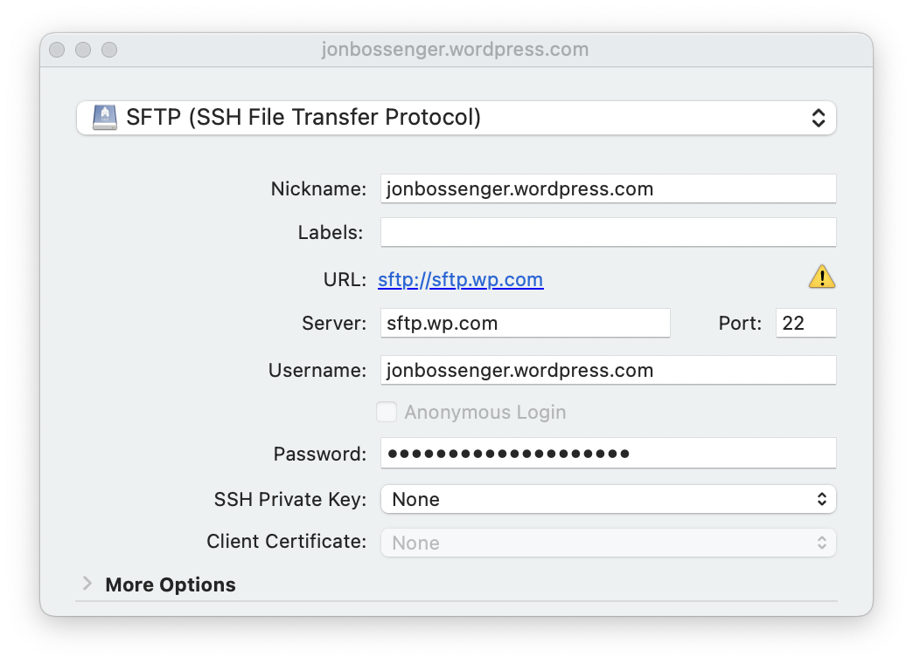
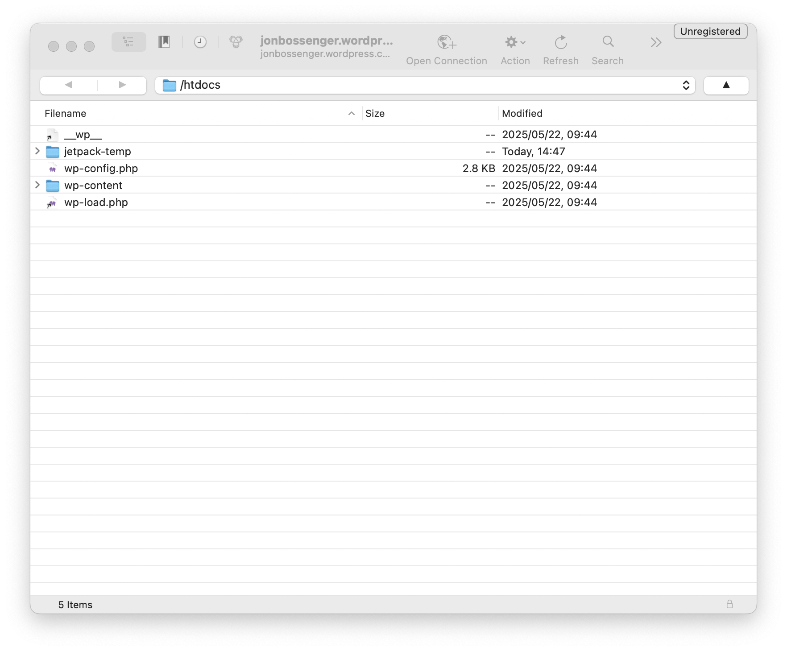

# Set Up a Client

An SFTP client is a tool that will accept your credentials and allow you to access your website's files. 

There are many clients available, but if you don't already have a preference, we recommend FileZilla, or Cyberduck. 

We have provided setup instructions below for both.

## FileZilla

FileZilla is a popular, free, and open-source SFTP client that works on Windows, macOS, and Linux. It is user-friendly and widely used for transferring files securely. You can download it from the [FileZilla website](https://filezilla-project.org/download.php).

1. Once installed, open Filezilla and navigate to *File → Site Manager*.
2. Click the "**New site**" button.
3. Set the *Protocol* field to *SFTP (SSH File Transfer Protocol)*, not FTP.
4. Add the credentials (URL [in the *Host* field], *Port*, *Username*, and *Password*) you obtained [earlier](credentials.md).

5. Click the **Connect** button.
6. If you are asked to accept the server's host key, click **OK** to proceed.

In the default FileZilla layout, you'll see your local files on the left and your site's files on the right. You can drag and drop files between your local computer and your site. 

## Cyberduck

Cyberduck is available both on macOS and Windows. You can download the Cyberduck from their website: [cyberduck.io](https://cyberduck.io/).

1. Open Cyberduck and click on the *New Bookmark* (**+**) button.
2. In the *New Bookmark* window, select *SFTP (SSH File Transfer Protocol)* from the dropdown.
3. Set the *Server*, *Port*, *Username* and *Password* fields with the credentials you obtained [earlier](credentials.md).

4. Close the *New Bookmark* window, and then double click on the bookmark to connect
5. If you are asked to accept the server's fingerprint key, click **Allow** to proceed.

Once connected, you will see your site's files in the Cyberduck interface. 

