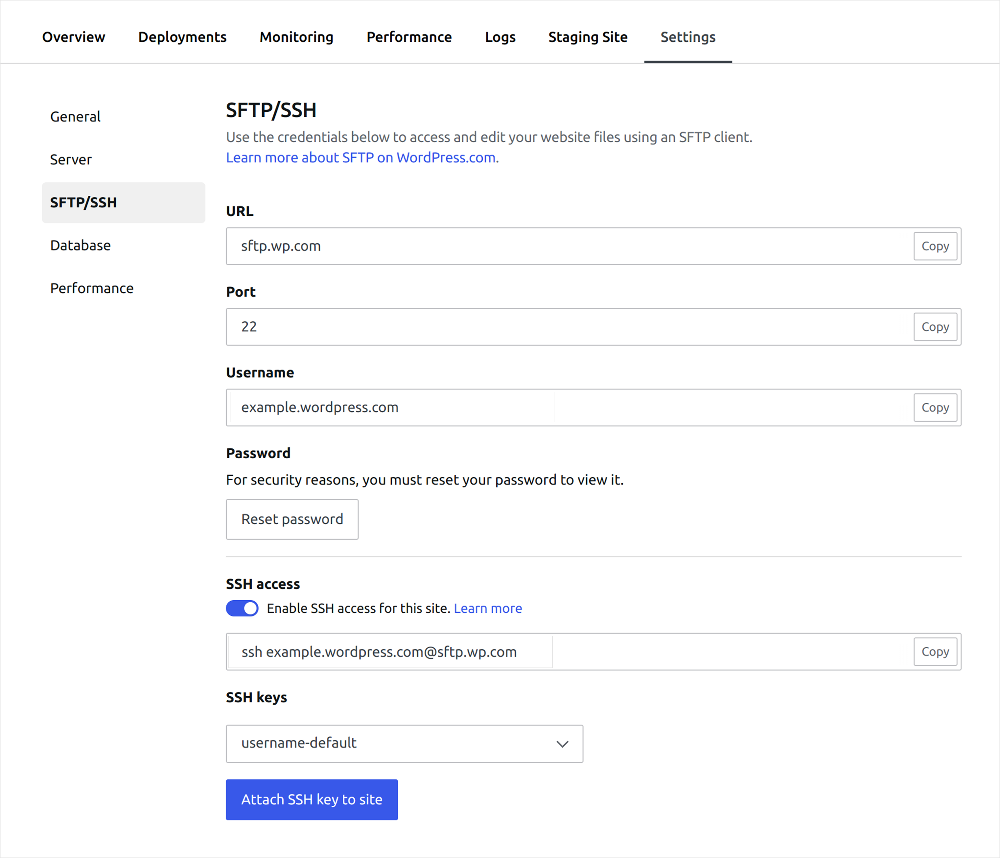
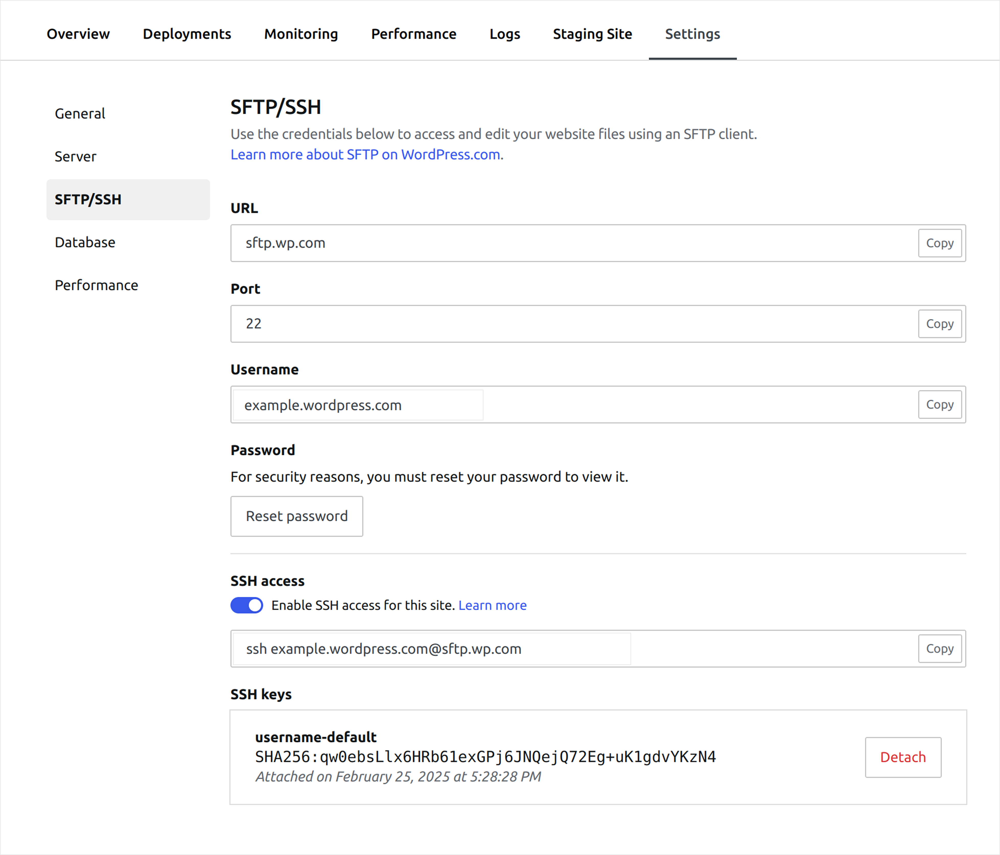

# SSH Keys

SSH Keys are a more secure way to connect via SSH. An SSH key pair comprises a private and public key. The public key is configured on the server, and the private key remains on the local computer. Once configured, SSH keys do not require you to enter a password every time you connect, as the key pair handles authentication. If the private key on the local computer matches the public key configured on the server, the user can connect.

The instructions below will guide you through the process of generating your SSH key pair, adding the public SSH Key to your WordPress.com account, and then attaching the public SSH key to any sites you'd like to use it with.

You can only add one public key per WordPress.com account, which you can then attach to multiple sites. Each site can have multiple keys attached, one per privileged user.

If you don't have an SSH Key pair on your computer, connecting to SSH via password authentication also works.

## Generate an SSH Key

You can generate SSH key pairs on Mac, Windows, and Linux. Once you create your key pairs, you can then add your public key to your WordPress.com account.

### Create an SSH Key on macOS and Linux

To generate an SSH key pair using macOS, take the following steps:

1. Open the Terminal.
2. Run the command `` `ssh-keygen -t ed25519` ``.
3. When prompted, enter the name of the file where you wish to store your key or press `Enter` to accept the default file name.
   1. On MacOS or Linux systems the default location is the `.ssh` directory in your home directory.
4. When prompted, type a secure passphrase to use with your key.

This will save a public and a private key in the chosen location. The public key, which you'll need for your WordPress.com account in the next step, will include the `.pub` extension.

### Create an SSH Key on Windows

To generate an SSH key using Windows, take the following steps:

1. Open PowerShell or cmd prompt.
2. Run the command `ssh-keygen -t ed25519`.
3. When prompted, enter the name of the file where you wish to store your key or press `Enter` to accept the default file name.
4. When prompted, type a secure passphrase to use with your key.

This will save a public and a private key in the chosen location. The public key, which you'll need for your WordPress.com account in the next step, will include the `.pub` extension.

## Add an SSH Key to Your Account

Before adding your SSH key to your WordPress.com account, you need to copy it to your clipboard. There are two ways to do this using your computer terminal:

**macOS**

```
pbcopy < ~/.ssh/id_rsa.pub
```

**Windows**

```
clip < ~/.ssh/id_rsa.pub
```

**Linux**

```
cat ~/.ssh/id_rsa.pub
```

If your SSH public key file uses a different name than the one mentioned above, edit the code to match the filename on your computer.

After copying your public SSH key to your clipboard, you will be able to add it to your account by following these steps:

1. From your WordPress.com dashboard, go to *My Profile* by clicking on your name in the top right-hand corner.
2. On the My Profile page, click on **Security**.
3. Click on the "**SSH Key**" option available in the Security Checklist.
4. Paste your SSH Key to the "**Public SSH Key**" field.
5. Click on the "**Save SSH Key**" button.


Once you add your SSH key to your WordPress.com account, you should attach it to each site you'd like to use it on.

## Attach an Existing SSH Key to a Site

After adding an SSH Key to your account, it will be necessary to attach it to the site you want to connect via SSH. To attach your SSH Key to a site, follow these steps:

1. Visit your site's dashboard and navigate to the site’s *Settings* page. This may be slightly different depending on your chosen Admin Interface Style.
   1. If you’re using the Classic style: *Hosting → Site Settings*
   2. If you’re using the Default style: *Settings → Server Settings*
2. Click on the **SFTP/SSH** tab
3. Use the **SSH Keys** dropdown to select the desired key.



4. Click on the **Attach SSH Key** to Site button.



Once your SSH key is attached to the site, you can use the SSH key when authenticating over SSH.

## Detach a Key from a Site

If you no longer want to connect to a site using your SSH Key, you can detach the key from the site by following these instructions:

1. Visit your site's dashboard and navigate to the site’s *Settings* page. This may be slightly different depending on your chosen Admin Interface Style.
   1. If you’re using the Classic style: *Hosting → Site Settings*
   2. If you’re using the Default style: *Settings → Server Settings*
2. Click on the **SFTP/SSH** tab
3. Under the **SSH Access** section, locate the SSH Key you want to remove.
4. Click on the **Detach** button to remove the key from the site.

The SSH key will still be associated with your WordPress.com account until you remove it.

## Update an Existing SSH Key

Follow the below steps to update your public SSH key:

1. From your WordPress.com dashboard, go to *My Profile* by clicking on your name in the top right-hand corner.
2. On the *My Profile* page, click on **Security**.
3. Click on the **SSH Key** option available in the Security Checklist.
4. Click on the **Update SSH key** button next to the key you wish to update.
5. Paste your updated SSH Key to the **New SSH Public Key** field.
6. Click the **Update SSH Key** button to save changes.

## Remove an Existing SSH Key

Removing an SSH key from your WordPress.com account will also detach it from each site it's associated with. To remove an existing SSH Key from your WordPress.com account, follow these steps:

1. From your WordPress.com dashboard, go to *My Profile* by clicking on your name in the top right-hand corner.
2. On the *My Profile* page, click on **Security**.
3. Click on the **SSH Key** option available in the Security Checklist.
4. Click on the **Remove SSH Key** button displayed beside the existing key.
5. A confirmation message will be displayed. Click the **OK** button to confirm that you want to remove the key.
